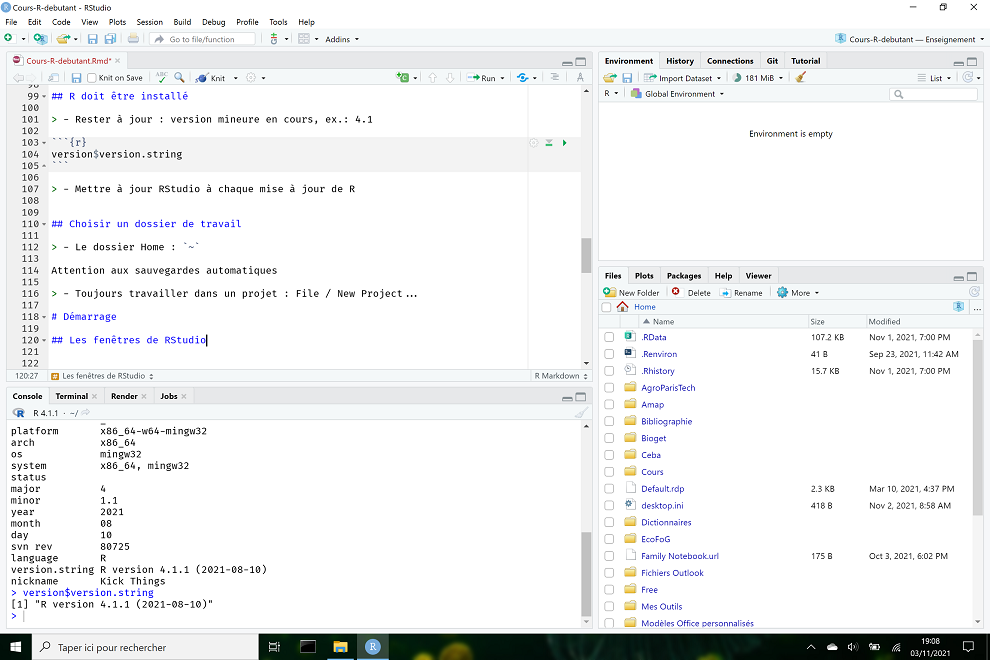

```{r DoNotModify, include=FALSE}
### Utilities. Do not modify.
# Installation of packages if necessary
InstallPackages <- function(Packages) {
  InstallPackage <- function(Package) {
    if (!Package %in% installed.packages()[, 1]) {
      install.packages(Package, repos="https://cran.rstudio.com/")
    }
  }
  invisible(sapply(Packages, InstallPackage))
}

# Basic packages
InstallPackages(c("bookdown", "formatR", "kableExtra", "ragg"))

# kableExtra must be loaded 
if (knitr::opts_knit$get("rmarkdown.pandoc.to") == "docx") {
  # Word output (https://stackoverflow.com/questions/35144130/in-knitr-how-can-i-test-for-if-the-output-will-be-pdf-or-word)
  # Do not use autoformat (https://github.com/haozhu233/kableExtra/issues/308)
  options(kableExtra.auto_format = FALSE)
}
library("kableExtra")

# Chunk font size hook: allows size='small' or any valid Latex font size in chunk options
def.chunk.hook  <- knitr::knit_hooks$get("chunk")
knitr::knit_hooks$set(chunk = function(x, options) {
  x <- def.chunk.hook(x, options)
  ifelse(options$size != "normalsize", paste0("\n \\", options$size,"\n\n", x, "\n\n \\normalsize"), x)
})
```

```{r Options, include=FALSE}
### Customized options for this document
# Add necessary packages here
Packages <- c("tidyverse", "entropart")
# Install them
InstallPackages(Packages)

# knitr options
knitr::opts_chunk$set(
  cache=FALSE, # Cache chunk results
  echo = TRUE, # Show/Hide R chunks
  warning=FALSE, # Show/Hide warnings
  message=FALSE,  # Show/Hide messages
  # Figure alignment and size
  fig.align='center', out.width='80%',
  # Graphic devices (ragg_png is better than standard png)
  dev = c("ragg_png", "pdf"),
  # Code chunk format
  tidy=TRUE, tidy.opts=list(blank=FALSE, width.cutoff=50),
  size="scriptsize", knitr.graphics.auto_pdf = TRUE
  )
options(width=50)

# ggplot style
library("tidyverse")
theme_set(theme_bw())
theme_update(panel.background=element_rect(fill="transparent", colour=NA),
             plot.background=element_rect(fill="transparent", colour=NA))
knitr::opts_chunk$set(dev.args=list(bg="transparent"))

# Tibbles: 5 lines, fit to slide width
options(tibble.print_min = 5, tibble.width = 50)

# Random seed
set.seed(973)
```


# Installation

## R doit être installé proprement

Rester à jour : version mineure en cours, ex.: 4.1
```{r}
version$version.string
```

Mettre à jour RStudio à chaque mise à jour de R

{ height=40px } Référence : Travailler avec R, [chapitre 1](https://ericmarcon.github.io/travailleR/chap-logiciels.html)


## Choisir un dossier de travail

Le dossier Home : `~`

{ height=40px } Toujours travailler dans un projet : File / New Project...

Ne jamais utiliser `setwd()` pour définir le dossier de travail: c'est toujours celui du projet.

## Packages

Les packages étendent les possibilités de R.

Installation depuis un dépôt officiel avec contrôle de qualité : CRAN.

Menu Tools / Install Packages...

Les packages sont installés dans `~/R/win-library/4.1/`

{ height=40px }Attention aux sauvegardes automatiques


# Démarrage

## Les fenêtres de RStudio{.flexbox .vcenter}

{ width=90% }


## Les variables{.columns-2} 

\begincols
  \begincol{.48\textwidth}
  
- Ecrire en haut à gauche

```{r}
# Affectation
a <- 1
# ou encore
1 -> a
# mais éviter
a = 1
```

- Exécuter (Ctrl+Entrée) : voir en bas à gauche.

- Suivre l'environnement en haut à droite.
  
  <p class="forceBreak"></p>
  \endcol
  \begincol{.48\textwidth}


{ width=100% }

  \endcol
\endcols


# Données

## R manipule des vecteurs

Plutôt que des nombres

```{r}
x <- 1:5
2*x
sqrt(x)
```

## Créer des vecteurs (1)

Des valeurs :
```{r}
(x <- 1)
(x <- c("pommes", "poires"))
(x <- c(TRUE, FALSE))
```

## Créer des vecteurs (2)

Une séquence :
```{r}
(x <- 1:5)
(x <- seq(from=1, to=5, by=1))
```

## Créer des vecteurs (3)

Une répétition :
```{r}
(x <- rep(1, 5))
(x <- rep(1:2, each=2))
```

{ height=40px }Utiliser systématiquement l'aide
```{r, eval=FALSE, tidy=FALSE}
?rep
```


## Sélectionner des éléments (1)

Utiliser les crochets :
```{r}
x <- (1:10)*10
x[3]
x[-5]
```

Utiliser des vecteurs pour sélectionner :
```{r}
x[c(1, 3)]
```

## Tester des éléments

Tirer des nombres dans une séquence, trouver lesquels sont pairs.
```{r}
x <- 1:100
# Echantillonnage
(y <- sample(x, 5))
(y %% 2 == 0)
```

## Sélectionner des éléments (2)

Utiliser les crochets :
```{r}
y[y %% 2 == 0]
```

Les compter :
```{r}
sum(y %% 2 == 0)
```

## Modes

Les vecteurs contiennent des données de même mode :

- numérique : `1:2`, `1L` (L pour un entier)
- imaginaire : `(1+1i)*(1-1i)` égale 2
- logique : `TRUE`
- caractère : `"Bonjour"`
- vide : `NULL`


## Matrices

Les matrices ont deux dimensions et contiennent des données de même mode

```{r}
(A <- matrix(1:9, nrow = 3))
```

## Sélectionner dans une matrice

```{r}
A[1, 2]
A[, 3]
```

## Tableaux

Extension des matrices à plus de deux dimensions
```{r}
A <- array(1:18, dim=c(3,3,2))
A[, , 2]
```

## Sélectionner dans un tableau

Comme dans une matrice :
```{r}
A[, , 2]
```

## Listes

Eléments disparates :
```{r}
(L <- list(noms=c("X", "Y"), tailles=c(100, 120)))
```

## Sélectionner dans une liste

Double crochet ou nom :
```{r}
L[[2]]
L$noms
```

## Dataframe

Tableau dont chaque colonne est de mode unique :
```{r}
(df <- data.frame(nom=c("X", "Y"), taille=c(100, 120)))
```

## Sélectionner dans un dataframe (1)

Sélection comme dans une matrice...
```{r}
df[2, ]
```

... ou comme dans une liste
```{r}
df$taille
```

## Sélectionner dans un dataframe (2)

Sélection de lignes en fonction de valeurs
```{r}
df[df$taille == 100, ]
```


# Fonctions

## Définition

R est un langage fonctionnel.
```{r}
y <- cos(pi)
```

Une fonction produit une valeur à partir d'arguments.

## Effets de bord

Une fonction peut avoir des effets de bord :
```{r, out.width="20%"}
x <- plot(y)
x
```

`plot` n'est utilisé que pour ses effets de bord.

## Arguments

Appeler une fonction en nommant tous ses arguments...
```{r}
runif(n=3, min=0, max=1)
```

... ou en les passant dans l'ordre :
```{r}
runif(3, 0, 1)
```

## Arguments nommés

Bonne pratique : nommer tous les arguments à partir du deuxième:
```{r}
runif(3, min=0, max=1)
```

## Valeurs par défaut

Voir l'aide de la fonction : `?runif`

`min` et `max` ont des valeurs par défaut : 0 et 1.
```{r}
runif(3)
```

## Créer 

Syntaxe:
```{r}
puissance <- function(x, r=1) {
  return(x^r)
}
puissance(1:3, r=2)
```
Penser vecteur.
`r` est recyclé.

```{r}
puissance(1:3, r=3:1)
```


# Structures de contrôle

## Si / Sinon

```{r}
est_pair <- function(x) {
  if (x%%2 == 0) {
    return(TRUE)
  } else {
    return(FALSE)
  }
}
est_pair(3)
```

{ height=40px }Fonction non vectorielle

## Boucles

```{r}
for (i in 1:3) {
  print(sqrt(i))
}
```
{ height=40px }Seulement si la fonction utilisée n'est pas vectorielle.
```{r}
sqrt(1:3)
```

# Graphiques de base

## plot

Graphiques simples :

```{r, out.width="40%"}
X <- 1:10
Y <- 2*X+rnorm(length(X))
plot(x=X, y=Y)
lines(x=X, y=Y, col="green", lty=2)
abline(a=0, b=2, col="red")
```

## Classes

Les objets appartiennent à des classes.
```{r}
Ns <- rlnorm(100)
class(Ns)
```

`plot` est une méthode, déclinée par classe.
```{r, out.width="20%"}
plot(Ns) # plot.numeric()
```

## Classes

```{r, out.width="20%"}
library("entropart")
Ns <- as.ProbaVector(Ns)
class(Ns)
plot(as.ProbaVector(Ns)) # plot.SpeciesDistribution
```

# Tidyverse

## Manifeste

Univers bien rangé.

Extension de R : ensemble de packages

```{r, include=FALSE}
library("tidyverse")
```

```{r, eval=FALSE}
library("tidyverse")
```

Manifeste
```{r, eval=FALSE}
vignette("manifesto")
```

## Données

Autant que possible dans un dataframe.

`tibble` : dataframe amélioré.
```{r}
(mon_tibble <- tibble(nom=c("X", "Y"), taille=c(100, 120)))
```

## Tuyau

Le résultat d'une fonction est le premier argument de la fonction suivante.
```{r}
x <- runif(100, max=10) %>% mean()
x
# ou même
100 %>% runif(max=10) %>% mean() %>% print() -> x
```

## Bagarre (1)

*Data wrangling* : lecture des données dans un tibble, sélection des lignes et colonnes, création de colonnes...

```{r, tidy=FALSE}
# Lecture des arbres de la parcelle 6 de Paracou
read_csv2("data/Paracou6.csv") %>% 
  # Ne garder que les fabaceae
  filter(Family == "Fabaceae") %>% 
  # Sélectionner les colonnes espèce et circonférence
  select(spName, CircCorr) %>% 
  # Calculer la surface terrière de chaque arbre en m2
  mutate(G = CircCorr^2/4/pi/10000) %>% 
  # Grouper par espèce
  group_by(spName) %>%
  # Calculer le nombre de tiges et la surface terrière par ha
  summarize(Abondance = n(), Surface = sum(G)/6.25 , .groups = 'drop') %>% 
  # Trier par G/ha décroissant
  arrange(desc(Surface)) ->
  mon_tibble
```

## Bagarre (2)

Travail fastidieux : 

- prévoir du temps
- capitaliser.

```{r}
mon_tibble
```


# Graphiques avec ggplot

## ggplot2

Package destiné à la création de graphiques.

Respecte la [grammaire graphique par couches](http://vita.had.co.nz/papers/layered-grammar.pdf) :

```
ggplot(data = <DATA>) + 
  <GEOM_FUNCTION>(
     mapping = aes(<MAPPINGS>),
     stat = <STAT>, 
     position = <POSITION>
  ) +
  <COORDINATE_FUNCTION> +
  <FACET_FUNCTION>
```

Les données sont obligatoirement un dataframe (un tibble est un dataframe).

## Esthétique

L'esthétique  désigne ce qui est représenté : 

- `x` et `y` (ou `fill` pour un histogramme...)
- transparence, couleur, type de courbe, taille... : voir l'aide de chaque `geom_`.

Fonction `aes()` à plusieurs niveaux :

- argument `mapping` de `ggplot()`, hérité par les couches (`geom_`)
- ou argument `mapping` de chaque couche.


## Géométrie

La géométrie est définie par une fonction `geom_xxx` et une esthétique (ce qui est représenté).

```{r, out.width='50%', tidy=FALSE}
ggplot(data = diamonds) + 
  geom_point(mapping = aes(x = carat, y = price, color = cut)) 
```

## Statistiques (1)

Chaque `geom_` va de pair avec une statistique de transformation des données : 

- "identity" pour `geom_point`
- "boxplot" pour `geom_boxplot`
- 20 statistiques disponibles...

## Statistiques (2)

```{r, out.width='70%', tidy=FALSE}
ggplot(data = diamonds) + 
  stat_summary(
    mapping = aes(x = cut, y = depth),
    fun.min = min,
    fun.max = max,
    fun = median
  )
```

## Echelle

Transformation de variable.

```{r, out.width='60%'}
diamonds %>% filter(carat>.5) %>% 
  ggplot(aes(x=carat, y=price)) + geom_point() + scale_x_log10() + scale_y_log10() + geom_smooth(method="lm")
```


## Position (1)

La position définit l'emplacement des objets sur le graphique.

- "identity" en général,
- "stack" empile les catégories dans un histogramme,
- "jitter" déplace aléatoirement les points dans un `geom_point` pour éviter les superpositions.


## Position (2)

```{r, out.width='70%', tidy=FALSE}
ggplot(data = diamonds) + 
  geom_bar(mapping = aes(x = cut, fill = color), position="stack") + 
  scale_fill_brewer(palette = "Set1")
```


## Coordonnées (1)

Système de coordonnées :

- `coord_flip()` intervertit `x` et `y`,
- `coord_polar()` : coordonnées polaires,
- `coord_trans()` transforme l'affichage des coordonnées (mais pas les données comme `scale_`),
- etc.

Exemple : tracer la carte des wapas de la parcelle 6.

## Coordonnées (2)

```{r, out.width='70%'}
read_csv2("data/Paracou6.csv") %>% filter(Genus=="Eperua") %>%
  ggplot() + geom_point(aes(x=Xfield, y=Yfield, size=CircCorr, color=Species)) + coord_fixed() -> P6Map
P6Map
```

## Facettes

Présente plusieurs aspects du même graphique:
```{r, out.width='50%'}
P6Map + facet_wrap(~ Species)
```

{ height=40px } Possibilité d'affiner un graphique

# Aller plus loin

## Rédiger avec RMarkdown

Plutôt qu'un code commenté, un texte avec du code.

Tricot : production de documents HTML ou PDF.

Rédaction d'articles, de mémoires, de diaporama.

Reproductibilité : le projet contient les données, le code, le texte et le modèle de mise en forme.

Galerie : https://ericmarcon.github.io/memoiR/

## Contrôle de source

git (contrôle de source) et GitHub (plateforme web) pour :

- tracer les versions d'un projet, 
- collaborer,
- tester le code automatiquement,
- tricoter automatiquement.

Exemple: https://github.com/EricMarcon/travailleR

## Sites web etc.

Il existe des packages pour tout.

Exemples :

- Site web : https://ericmarcon.github.io/fr/,
- Application Shiny : https://vac-lshtm.shinyapps.io/ncov_tracker/,
- TP en ligne : https://eric-marcon.shinyapps.io/TP-Biodiversite/.


<!-- Styles for HTML slides -->
<!-- https://stackoverflow.com/questions/38260799/references-page-truncated-in-rmarkdown-ioslides-presentation/38294541#38294541 -->
<style>
  .forceBreak { -webkit-column-break-after: always; break-after: column; }
  slides > slide { overflow: scroll; }
  slides > slide:not(.nobackground):after { content: ''; }
</style>
